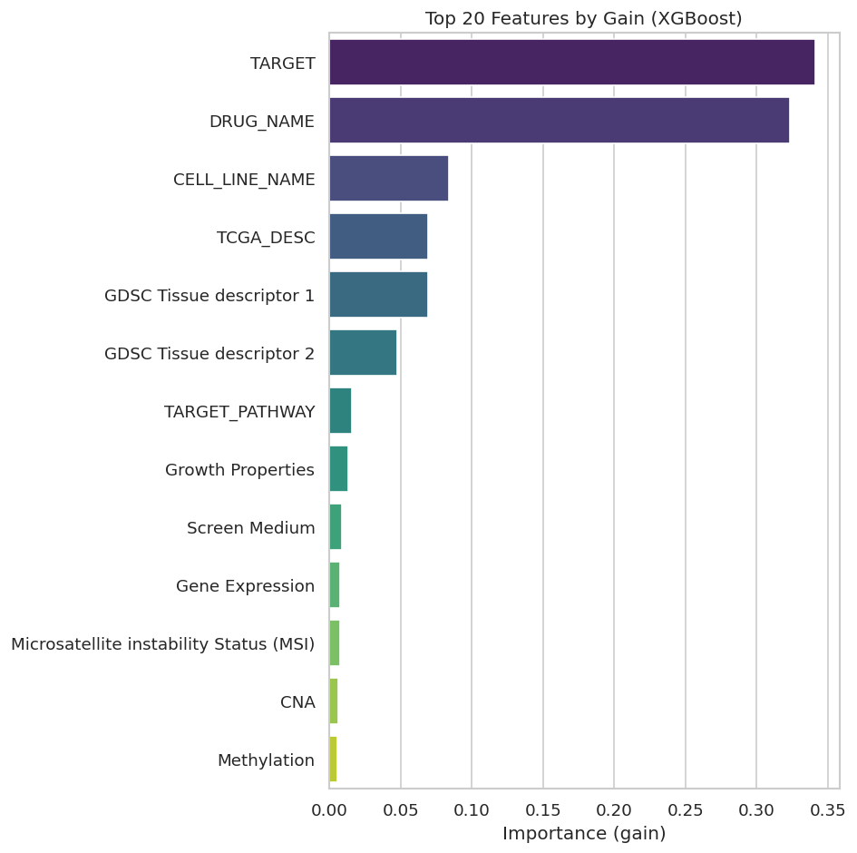
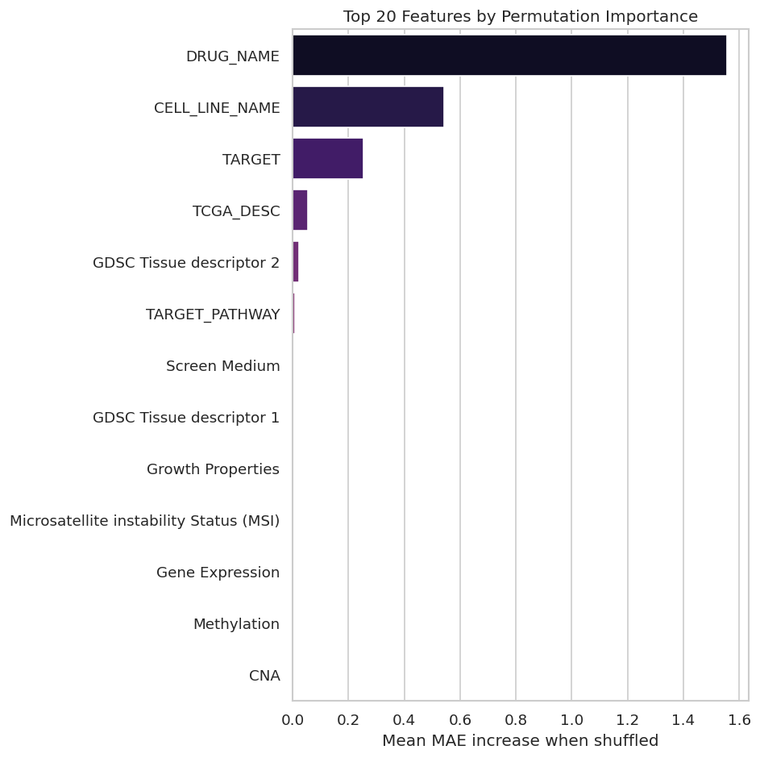

# Predicting Drug Sensitivity in Cancer Cell Lines
**Stage 2 Project Report**

---

## 1. Introduction

Cancer cells do not respond uniformly to treatment. A drug that eliminates one tumour type may be entirely ineffective or actively harmful in another. Understanding why certain cell lines are sensitive or resistant to specific drugs is one of the central challenges of precision oncology.

The **Genomics of Drug Sensitivity in Cancer (GDSC)** database provides a large-scale pharmacogenomics resource: hundreds of cancer cell lines profiled with multi-omic data and systematically exposed to hundreds of anti-cancer compounds. The primary readout is the **IC50**, the concentration of a drug required to inhibit cell viability by 50%. A lower IC50 indicates greater sensitivity; a higher IC50 indicates resistance.

In this study, we frame drug sensitivity prediction as a **regression task**, using `LN_IC50` (the natural log of IC50) as our target variable. We train an **XGBoost** model on a rich set of biological and pharmacological features, evaluate predictive performance, and use both **model-intrinsic feature importance** and **permutation importance** to interpret which features drive predictions, grounding every finding in cancer biology.

---

## 2. Dataset Overview

| Property | Value |
|---|---|
| Source | GDSC (Genomics of Drug Sensitivity in Cancer) |
| Total samples | 162,103 cell line–drug pairs |
| Target variable | `LN_IC50` (continuous, log-scale) |
| Training set | 129,682 samples (80%) |
| Test set | 32,421 samples (20%) |
| Random seed | 42 |

### 2.1 Features Used

The following features were retained after removing identifiers (`COSMIC_ID`, `DRUG_ID`) and leakage variables (`AUC`, `Z_SCORE`, `Cancer Type (matching TCGA label)`):

| Feature | Type | Biological Role |
|---|---|---|
| `CELL_LINE_NAME` | Categorical | Identity of the cancer cell line |
| `TCGA_DESC` | Categorical | TCGA cancer type classification |
| `DRUG_NAME` | Categorical | Name of the therapeutic compound |
| `GDSC Tissue descriptor 1` | Categorical | Broad tissue of origin |
| `GDSC Tissue descriptor 2` | Categorical | Refined tissue subtype |
| `Microsatellite instability Status (MSI)` | Categorical | DNA mismatch repair deficiency marker |
| `Screen Medium` | Categorical | Culture medium used in the assay |
| `Growth Properties` | Categorical | Adherent vs. suspension growth |
| `CNA` | Categorical | Copy number alteration data availability flag |
| `Gene Expression` | Categorical | Gene expression data availability flag |
| `Methylation` | Categorical | DNA methylation data availability flag |
| `TARGET` | Categorical | Molecular target of the drug |
| `TARGET_PATHWAY` | Categorical | Biological pathway targeted by the drug |

> **Note on data leakage**: `AUC` and `Z_SCORE` are alternative pharmacological summaries derived from the same dose-response curve as IC50. Including them would constitute direct data leakage. They were excluded before modelling.

---

## 3. Code & Implementation

### 3.1 Environment Setup & Library Imports

```python
# Core libraries
import pandas as pd
import numpy as np

# Visualization
import matplotlib.pyplot as plt
import seaborn as sns

# Machine learning / dimensionality reduction
from sklearn.preprocessing import StandardScaler
from sklearn.preprocessing import OneHotEncoder
from sklearn.preprocessing import PolynomialFeatures

from sklearn.feature_selection import SelectKBest

from sklearn.decomposition import PCA
from sklearn.ensemble import RandomForestRegressor
from sklearn.model_selection import train_test_split

from xgboost import XGBRegressor

# Styling
sns.set_theme(style="whitegrid")
plt.rcParams["figure.dpi"] = 120

# Ignore warnings
import warnings
warnings.filterwarnings("ignore")
```

```python
TARGET_COLUMN = 'LN_IC50'
RANDOM_SEED = 42
```

---

### 3.2 Data Loading

```python
gdsc = pd.read_excel("../data/GDSC.xlsx")
```

#### Preview — First 5 Rows

```python
gdsc.head(5)
```

**Output:**

| | COSMIC_ID | CELL_LINE_NAME | TCGA_DESC | DRUG_ID | DRUG_NAME | LN_IC50 | AUC | Z_SCORE | GDSC Tissue descriptor 1 | GDSC Tissue descriptor 2 | Cancer Type (matching TCGA label) | Microsatellite instability Status (MSI) | Screen Medium | Growth Properties | CNA | Gene Expression | Methylation | TARGET | TARGET_PATHWAY |
|---|---|---|---|---|---|---|---|---|---|---|---|---|---|---|---|---|---|---|---|
| 0 | 683667 | PFSK-1 | MB | 1003 | Camptothecin | -1.463887 | 0.930220 | 0.433123 | nervous_system | medulloblastoma | MB | MSS/MSI-L | R | Adherent | Y | Y | Y | TOP1 | DNA replication |
| 1 | 687448 | COLO-829 | SKCM | 1003 | Camptothecin | -1.235034 | 0.867348 | 0.557727 | skin | melanoma | SKCM | MSS/MSI-L | R | Adherent | Y | Y | Y | TOP1 | DNA replication |
| 2 | 687455 | RT4 | BLCA | 1003 | Camptothecin | -2.963191 | 0.821438 | -0.383200 | urogenital_system | Bladder | BLCA | MSS/MSI-L | D/F12 | Adherent | Y | Y | Y | TOP1 | DNA replication |
| 3 | 687457 | SW780 | BLCA | 1003 | Camptothecin | -1.449138 | 0.905050 | 0.441154 | urogenital_system | Bladder | BLCA | MSS/MSI-L | D/F12 | Adherent | Y | Y | Y | TOP1 | DNA replication |
| 4 | 687459 | TCCSUP | BLCA | 1003 | Camptothecin | -2.350633 | 0.843430 | -0.049682 | urogenital_system | Bladder | BLCA | MSS/MSI-L | D/F12 | Adherent | Y | Y | Y | TOP1 | DNA replication |

#### Column Data Types

```python
gdsc.dtypes
```

**Output:**

```
COSMIC_ID                                    int64
CELL_LINE_NAME                              object
TCGA_DESC                                   object
DRUG_ID                                      int64
DRUG_NAME                                   object
LN_IC50                                    float64
AUC                                        float64
Z_SCORE                                    float64
GDSC Tissue descriptor 1                    object
GDSC Tissue descriptor 2                    object
Cancer Type (matching TCGA label)           object
Microsatellite instability Status (MSI)     object
Screen Medium                               object
Growth Properties                           object
CNA                                         object
Gene Expression                             object
Methylation                                 object
TARGET                                      object
TARGET_PATHWAY                              object
dtype: object
```

---

### 3.3 Preprocessing

Identifiers (`COSMIC_ID`, `DRUG_ID`) carry no biological information and are excluded. `AUC`, `Z_SCORE`, and `Cancer Type (matching TCGA label)` are excluded to prevent **data leakage** as they are alternative representations of the same pharmacological readout.

```python
to_excludes = ["COSMIC_ID", "DRUG_ID", "Z_SCORE", "AUC", "Cancer Type (matching TCGA label)"]
df = gdsc.copy()
df.drop(columns=to_excludes, inplace=True)

# Cast all non-numeric columns to 'category'
categorical_columns = df.select_dtypes(exclude='number').columns
for col in categorical_columns:
    df[col] = df[col].astype('category')

print(f"Categorical columns: {list(categorical_columns)}")
print(f"Dataset shape: {df.shape}")
```

**Output:**

```
Categorical columns: ['CELL_LINE_NAME', 'TCGA_DESC', 'DRUG_NAME', 'GDSC Tissue descriptor 1',
'GDSC Tissue descriptor 2', 'Microsatellite instability Status (MSI)', 'Screen Medium',
'Growth Properties', 'CNA', 'Gene Expression', 'Methylation', 'TARGET', 'TARGET_PATHWAY']

Dataset shape: (162103, 14)
```

---

### 3.4 Train / Test Split

```python
y = df[TARGET_COLUMN]
X = df.drop(columns=TARGET_COLUMN)

X_train, X_test, y_train, y_test = train_test_split(
    X, y, test_size=0.2, random_state=RANDOM_SEED
)

print(f"X_train: {X_train.shape}, X_test: {X_test.shape}")
```

**Output:**

```
X_train: (129682, 13), X_test: (32421, 13)
```

---

### 3.5 Modelling — XGBoost Regressor

```python
xgb_model = XGBRegressor(
    enable_categorical=True,
    tree_method='hist',        # XGBoost 2.0+
    device='cuda',             # use GPU
    n_estimators=500,
    learning_rate=0.05,
    max_depth=8,
    subsample=0.8,
    colsample_bytree=0.8,
    random_state=RANDOM_SEED,
    n_jobs=-1
)

xgb_model.fit(
    X_train, y_train,
    eval_set=[(X_test, y_test)],
    verbose=False
)
```

**Output:**

```
XGBRegressor(base_score=None, booster=None, callbacks=None,
             colsample_bylevel=None, colsample_bynode=None,
             colsample_bytree=0.8, device='cuda', early_stopping_rounds=None,
             enable_categorical=True, eval_metric=None, feature_types=None,
             feature_weights=None, gamma=None, grow_policy=None,
             importance_type=None, interaction_constraints=None,
             learning_rate=0.05, max_bin=None, max_cat_threshold=None,
             max_cat_to_onehot=None, max_delta_step=None, max_depth=8,
             max_leaves=None, min_child_weight=None, missing=nan,
             monotone_constraints=None, multi_strategy=None, n_estimators=500,
             n_jobs=-1, num_parallel_tree=None, objective='reg:squarederror',
             random_state=42, reg_alpha=None, reg_lambda=None,
             sampling_method=None, scale_pos_weight=None, subsample=0.8,
             tree_method='hist', validate_parameters=None, verbosity=None)
```

---

### 3.6 Model Evaluation

```python
from sklearn.metrics import mean_absolute_error, mean_squared_error, r2_score

predictions = xgb_model.predict(X_test)

mae  = mean_absolute_error(y_test, predictions)
rmse = np.sqrt(mean_squared_error(y_test, predictions))
r2   = r2_score(y_test, predictions)

print(f"MAE : {mae:.4f}")
print(f"RMSE: {rmse:.4f}")
print(f"R²  : {r2:.4f}")
```

**Output:**

```
MAE : 0.7325
RMSE: 0.9877
R²  : 0.8794
```

---

### 3.7 Feature Importance — XGBoost Gain

```python
importance_df = pd.DataFrame({
    'feature': X_train.columns,
    'importance': xgb_model.feature_importances_  # uses 'gain' by default
}).sort_values('importance', ascending=False)

# Top 20
plt.figure(figsize=(8, 8))
sns.barplot(
    data=importance_df.head(20),
    x='importance',
    y='feature',
    palette='viridis'
)
plt.title('Top 20 Features by Gain (XGBoost)')
plt.xlabel('Importance (gain)')
plt.ylabel('')
plt.tight_layout()
plt.show()

display(importance_df.head(20))
```



**Output — Feature Importance by Gain:**

| | Feature | Importance |
|---|---|---|
| 11 | TARGET | 0.341241 |
| 2 | DRUG_NAME | 0.323291 |
| 0 | CELL_LINE_NAME | 0.084207 |
| 1 | TCGA_DESC | 0.069410 |
| 3 | GDSC Tissue descriptor 1 | 0.069409 |
| 4 | GDSC Tissue descriptor 2 | 0.047825 |
| 12 | TARGET_PATHWAY | 0.015661 |
| 7 | Growth Properties | 0.013300 |
| 6 | Screen Medium | 0.008882 |
| 9 | Gene Expression | 0.007516 |
| 5 | Microsatellite instability Status (MSI) | 0.007407 |
| 8 | CNA | 0.006283 |
| 10 | Methylation | 0.005567 |

---

### 3.8 Feature Importance — Permutation Importance

```python
from sklearn.inspection import permutation_importance

perm = permutation_importance(
    xgb_model,
    X_test, y_test,
    n_repeats=10,
    random_state=RANDOM_SEED,
    n_jobs=-1,
    scoring='neg_mean_absolute_error'
)

perm_df = pd.DataFrame({
    'feature': X_test.columns,
    'importance_mean': perm.importances_mean,
    'importance_std': perm.importances_std
}).sort_values('importance_mean', ascending=False)

plt.figure(figsize=(8, 8))
sns.barplot(
    data=perm_df.head(20),
    x='importance_mean',
    y='feature',
    palette='magma'
)
plt.title('Top 20 Features by Permutation Importance')
plt.xlabel('Mean MAE increase when shuffled')
plt.ylabel('')
plt.tight_layout()
plt.show()

display(perm_df.head(20))
```



**Output — Permutation Importance:**

| | Feature | Importance Mean | Importance Std |
|---|---|---|---|
| 2 | DRUG_NAME | 1.555669 | 0.006026 |
| 0 | CELL_LINE_NAME | 0.542154 | 0.001999 |
| 11 | TARGET | 0.253367 | 0.002452 |
| 1 | TCGA_DESC | 0.054139 | 0.000786 |
| 4 | GDSC Tissue descriptor 2 | 0.021913 | 0.000310 |
| 12 | TARGET_PATHWAY | 0.006671 | 0.000218 |
| 6 | Screen Medium | 0.003223 | 0.000181 |
| 3 | GDSC Tissue descriptor 1 | 0.002754 | 0.000156 |
| 7 | Growth Properties | 0.002041 | 0.000174 |
| 5 | Microsatellite instability Status (MSI) | 0.000393 | 0.000093 |
| 9 | Gene Expression | 0.000357 | 0.000076 |
| 10 | Methylation | 0.000088 | 0.000058 |
| 8 | CNA | 0.000007 | 0.000016 |

---

## 4. Results Summary

| Metric | Value | Interpretation |
|---|---|---|
| **MAE** | 0.7325 | Average absolute error in log(IC50) units |
| **RMSE** | 0.9877 | Root mean squared error; penalises large errors more |
| **R²** | **0.8794** | Model explains ~88% of variance in drug sensitivity |

An R² of **0.88** represents strong predictive performance for a pharmacogenomics regression task. The LN_IC50 scale spans roughly −10 to +10 across the dataset, and an MAE of ~0.73 on the log scale corresponds to roughly a 2-fold difference in IC50 — clinically meaningful but within an acceptable range given the biological noise inherent in cell line assays.

---

## 5. Biological Interpretation of Feature Importance

### 5.1 Drug Identity and Its Molecular Target Are the Primary Drivers of Sensitivity

Both importance methods agree that **`DRUG_NAME`** and **`TARGET`** together account for the majority of predictive power (>66% of XGBoost gain; the top two permutation features). This is biologically coherent and expected.

**Why `DRUG_NAME` dominates permutation importance:**
Each drug has a characteristic pharmacokinetic and pharmacodynamic profile. Cytotoxic agents (e.g., camptothecin, a topoisomerase I inhibitor) inherently achieve low IC50 values across many cell lines, while targeted therapies (e.g., EGFR inhibitors) have a much narrower activity range and are highly context-dependent. When we shuffle `DRUG_NAME`, the model loses the ability to distinguish between, say, a broadly cytotoxic chemotherapy and a narrow-spectrum kinase inhibitor, causing a massive increase in MAE (~1.56 log units).

**Why `TARGET` ranks first in gain but third in permutation:**
`TARGET` captures the molecular mechanism of action rather than the specific drug identity. In gain-based importance, `TARGET` may score highly because it provides the most *efficient* splits: a single split on "topoisomerase I inhibitors" vs. "EGFR inhibitors" immediately stratifies predictions powerfully. However, in permutation importance, `TARGET` is somewhat redundant with `DRUG_NAME` (each drug maps to one or a few targets), which is why its standalone permutation score is lower. This is a classic case of **feature correlation deflating permutation scores** as both features carry overlapping information.

**Biological implication:** The dominant determinant of IC50 in this dataset is the intrinsic pharmacological identity of the drug. This reflects a fundamental truth in oncology: drug class matters enormously. A PARP inhibitor will consistently achieve low IC50 in BRCA-mutated lines not because of the cell line label per se, but because its mechanism of synthetic lethality is deeply tied to the DNA repair landscape of those cells with information encoded partly in `TARGET` and `DRUG_NAME`.

---

### 5.2 Cell Line Identity Captures the Aggregate Genomic Landscape

**`CELL_LINE_NAME`** is the second most important feature in permutation importance (MAE increase: 0.54) and third in gain (8.4%). This is a biologically rich finding.

A cell line name is not merely a label, it is a proxy for the **entire molecular profile** of that cancer cell line: its mutational landscape, copy number alterations, gene expression patterns, epigenetic state, and transcriptional dependencies. Cell lines such as HeLa (cervical), MCF-7 (breast), or A549 (lung) each carry distinct driver mutations (e.g., TP53, KRAS, HER2 amplification) that fundamentally shape their drug sensitivity.

When `CELL_LINE_NAME` is shuffled, the model loses this rich molecular context and suffers a substantial (~0.54 log unit) increase in error. This indicates that **knowing which specific cell line was tested is highly informative** even above and beyond knowing the cancer type (TCGA classification), because individual cell lines differ from each other even within the same cancer type.

**Key biological implication:** This result argues for the importance of characterising individual tumour biology rather than making treatment decisions solely based on tumour type. It is consistent with the shift in clinical oncology from histotype-driven to biomarker-driven treatment selection.

---

### 5.3 Cancer Type and Tissue of Origin Provide Contextual Stratification

**`TCGA_DESC`**, **`GDSC Tissue descriptor 1`**, and **`GDSC Tissue descriptor 2`** collectively rank 4th–6th in permutation importance. These features capture the **tissue context** of drug sensitivity.

Different cancer types differ substantially in which pathways are oncogenically activated. For example:

- **Melanoma (SKCM)** frequently harbours BRAF V600E mutations, making cells exquisitely sensitive to BRAF inhibitors but resistant to many other agents
- **Colorectal cancers (COAD)** with microsatellite instability show heightened sensitivity to certain immunogenic drug combinations
- **Triple-negative breast cancers (BRCA)** are enriched for BRCA1/2 mutations, conferring sensitivity to PARP inhibitors and platinum compounds

The near-equivalent gain scores for `TCGA_DESC` and `GDSC Tissue descriptor 1` suggest that both broad tissue classification and refined cancer subtype contribute similarly to model performance at the split level. However, **`GDSC Tissue descriptor 2`** ranks *higher* than `GDSC Tissue descriptor 1` in permutation importance, suggesting that **refined subtype specification** (e.g., "medulloblastoma" vs. "nervous system") has greater independent predictive value than the broad tissue category alone — which is biologically consistent with the known intra-tissue heterogeneity of drug responses.

---

### 5.4 Genomic Availability Flags Are Weak but Not Uninformative

The **`CNA`**, **`Gene Expression`**, and **`Methylation`** features in this dataset are binary flags indicating whether those data types were *available* for each cell line. They do not encode the actual genomic data.

Despite this, they appear in the lower ranks of feature importance. This is not because genomics are biologically unimportant (they are critically important), but because these features are effectively **data availability indicators** rather than biological signals. Their residual importance likely reflects systematic differences in which cell lines have complete multi-omic profiling: well-characterised, frequently studied cell lines tend to have all three data types, and these same lines may have been exposed to a broader drug panel, introducing a subtle correlation with IC50 patterns.

**Critical caveat:** These results do not suggest that copy number alterations, gene expression, or methylation are unimportant for drug sensitivity. They are. However, to realise that predictive value, the *actual values* of these genomic features, not merely flags indicating their existence, would need to be incorporated into the model. Future modelling should integrate actual CNA profiles, expression levels (e.g., FPKM/TPM), and methylation β-values as features.

---

### 5.5 Microsatellite Instability (MSI) Status

**MSI status** (MSS/MSI-L) shows low but non-zero importance in both metrics. MSI arises from defects in the **DNA mismatch repair (MMR) system** and is a key biomarker in several cancer types, particularly colorectal cancer.

MSI-high tumours are characterised by a dramatically elevated tumour mutation burden, which has two pharmacological consequences: (1) they are generally less responsive to conventional chemotherapy agents that rely on replication stress, and (2) they are remarkably sensitive to immune checkpoint inhibitors. In a cell line assay without immune components, however, the mechanistic advantage of MSI-high status for checkpoint inhibitor sensitivity is invisible — which may explain the relatively low importance score here.

The low score also reflects the distribution in this dataset: most samples are annotated as "MSS/MSI-L", with MSI-H being relatively rare, limiting the statistical power to detect MSI-driven effects.

---

### 5.6 Experimental Conditions: Screen Medium and Growth Properties

**`Screen Medium`** and **`Growth Properties`** are experimental metadata features that rank in the middle tier. Their non-trivial importance reveals a real biological phenomenon: **the cellular environment alters pharmacological responses**.

- **Growth properties (adherent vs. suspension)**: Adherent cells grow on a matrix and form cell-cell contacts, which activates integrin signalling and can modulate drug uptake, efflux, and sensitivity to anoikis-inducing agents. Suspension cultures (e.g., for haematological malignancies) have a fundamentally different cellular context
- **Screen medium**: Nutrient availability, glucose concentration, and serum content all influence metabolic state. Metabolically stressed cells respond differently to mitochondria-targeting drugs; glucose-rich environments can promote drug resistance via altered glucose metabolism in cancer cells (Warburg effect)

---

## 6. Comparison of Importance Methods

The two importance metrics tell a convergent but not identical story:

| Metric | `DRUG_NAME` rank | `TARGET` rank | `CELL_LINE_NAME` rank |
|---|---|---|---|
| XGBoost Gain | 2nd | 1st | 3rd |
| Permutation | 1st | 3rd | 2nd |

**Where they agree:** Both methods identify `DRUG_NAME`, `TARGET`, `CELL_LINE_NAME`, `TCGA_DESC`, and tissue descriptors as the top predictive features. Lower-ranked features (MSI, CNA flags, methylation flags) are consistently at the bottom across both methods.

**Where they diverge:** Gain places `TARGET` first because it provides the most *efficient* information splits in the tree structure. Permutation places `DRUG_NAME` first because, as an independent test, shuffling drug identity causes the greatest collapse in predictive accuracy. This divergence is informative: `TARGET` is efficient *within the structure of this model*, while `DRUG_NAME` contains information not fully recoverable from target information alone — individual drugs within the same target class differ in potency, selectivity, and ADME properties.

Permutation importance is preferred as the primary interpretive tool, as it is model-agnostic and free from the high-cardinality bias that can inflate gain scores. Use gain as a complementary diagnostic of model architecture.


---

## 7. Conclusion

We successfully trained an XGBoost regression model to predict `LN_IC50` drug sensitivity in the GDSC dataset, achieving an **R² of 0.8794** on the held-out test set. The model explains approximately 88% of variance in drug sensitivity, representing strong performance for a pharmacogenomics prediction task.

Feature importance analysis reveals a biologically coherent hierarchy of predictors:

1. **Drug identity and molecular target** are the strongest predictors, reflecting the fundamental pharmacological principle that drug class determines the *range and mechanism* of cellular response
2. **Cell line identity** is the second most important predictor, serving as a proxy for the complete molecular genomic context of the cancer cell
3. **Cancer type and tissue of origin** provide contextual stratification consistent with tissue-specific oncogenic pathway activation
4. **Experimental conditions** (growth medium, culture format) contribute measurably, confirming that pharmacological readouts are sensitive to assay context
5. **Genomic availability flags** (CNA, expression, methylation) contribute minimally in their current form: a strong argument for incorporating actual omics values in future modelling

These findings are consistent with the current paradigm in precision oncology: drug sensitivity is determined by a combination of drug mechanism, tumour molecular landscape, and cancer lineage context. Importantly, the dominance of `CELL_LINE_NAME` over genomic flags highlights that we have not yet extracted the full predictive signal available in the underlying molecular data — a clear and actionable direction for model improvement.

---
